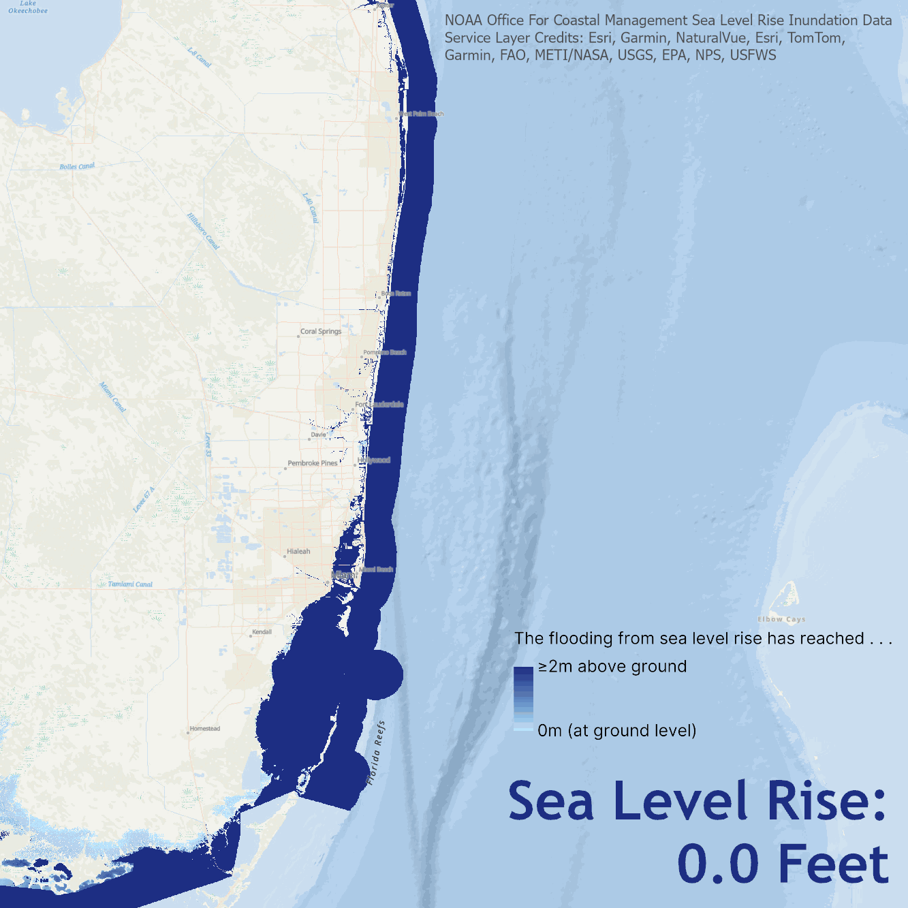

# Over the Years, a Climate Storytelling 2075 Project

## Final Artwork

"Over the Years" is a multimedia artwork that explores data visualization as an avenue for climate storytelling. Inspired by the role of location—how we interact with each other, with our histories, and with our environment—this artwork features a timelapse of projected flooding from sea level rise up to 10 feet in the Everglades in South Florida, a line graph of sea levels off the coast of Southeast Florida from 1994 to 2023, overlaid with a personal portrait. Accompanying these visuals is a short poem that delves into my emotions regarding the escalating climate crisis.

## Poem
```
over the years
I can feel
the thrashing
in my heartbeat
as veins of
seagrass unfurl
against the ocean's
restless rise
we know we must
rise higher
```
I wrote this poem in reflection of my fear and hope surrounding the climate crisis. I often feel overwhelmed by the vast changes that are happening and how communities are being impacted by climate change—yet I strongly believe in the power of communities to come together and create equitable, sustainable solutions.

# Data

## Sea Level Change
Visualizing local sea level data from the [NOAA tide-monitoring station](https://tidesandcurrents.noaa.gov/stations.html) at Virginia Key, Florida, near my home in Southeast Florida. More information is available at the [CO-OPS Relative Sea Level Trends Tool](https://www.climate.gov/news-features/features/interactive-map-how-has-local-sea-level-united-states-changed-over-time).

<p align="center">
  
</p>

The graph shows sea level change (relative to the mean sea level from 1983–2001) in Virginia Key, Florida for each month from 1994 to 2023. The color indicates the year: darker colors show monthly data from years closer to 2023, and ligher colors show monthly data from years closer to 1994. There is a prominent rise in sea level for the observed region (Virginia Key, Florida), and similar trends of sea level rise are seen in many other regions. This graph is rotated 90&deg; in the final artwork.

## Projected Sea Level Rise
Visualizing projected flooding from sea level rise (of 0 feet to 10 feet above average high tides in increments of 0.5 feet). The sea level depth data is from the [NOAA Office for Coastal Management's (OCM) Sea Level Rise Viewer](https://coast.noaa.gov/digitalcoast/tools/slr.html). The colors represent depth in meters above ground for the projected sea level rise, with darker blues indicating the sea level is higher above ground, and lighter blues indicating the sea level is at ground level. The satellite image is a composite Sentinel-2 image from March to May 2024 downloaded using the `rsi` package in R developed by Michael Mahoney.

<p align="center">
  
</p>

The figure above shows the region included in the final artwork, a part of the Everglades in South Florida. The [state boundary lines](https://www.arcgis.com/home/item.html?id=774019f31f8549c39b5c72f149bbe74e) are from the U.S. Census Bureau, accessed through Esri.

<p align="center">
  
</p>

The figure above shows all the images that make up the timelapse, starting at 0 feet (at the level of average high tides). Each image after shows projected flooding from a 0.5 feet increase in sea level from the previous image, ending at 10 feet above average high tides.

<p align="center">
  
</p>

The figure above shows the same data (projected flooding from sea level rise up to 10 feet), but zoomed out to Southeast Florida.

# First Version of the Artwork


The process of creating this artwork was a journey for me, where I explored various data visualizations and emotions that I wanted to portray before landing on what became the final version. This is my initial sketch for `Over the Years`, which includes satellite data and a poem with slightly different wording. The portrait is overlaid with a timelapse of modified Sentinel-2 satellite images showing a part of the coast of Southwest Florida from 2017 to 2023, downloaded using the `create timelapse animation` tool in [Sentinel Hub EO Browser](https://apps.sentinel-hub.com/eo-browser/). I enjoyed exploring the process of creating art with satellite images, as I feel that satellite images have a lot to tell us—not just about the physical landscape but also about how we interact with the environment. Ultimately, I decided to use other data in the final artwork as I wanted to show both historical and projected sea level rise in Florida.

# Acknowledgements
Thank you for reading about my artwork! I am so grateful to the team behind [Climate Storytelling 2075](https://storytelling-2075.tumblr.com/) for their feedback and support in creating this artwork. I am inspired by this vibrant community of passionate storytellers and learned so much from everyone.

# Artist Statement
I create digital artwork that reflects data about the world around us and the complicated emotions interconnected with our identities and experiences. Growing up in coastal cities, I have seen the reality of the climate crisis, but I found the massive amounts of data surrounding climate change and its impacts to be overwhelming. The creativity and flexibility of digital art allows me to better process climate change data—emphasizing both the urgency of the climate crisis and the hope for collaborative, equitable, and intersectional solutions.

My artwork reflects my personal experiences—being born in New Orleans just a few months before Hurricane Katrina hit, which became the costliest and one of the most destructive hurricanes in US history. I think of my mother’s strength as she drove my brother and I to safety amongst the chaos of evacuation. I think of how it’s shaped our lives, especially as we have faced more hurricanes since moving to South Florida. Art is my way of expressing all these emotions at once—strength and urgency, fear and hope.
